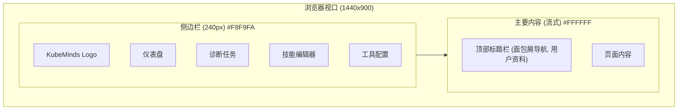

# KubeMinds SRE 仪表盘设计规范

## 1. 设计概览
本文档概述了 KubeMinds SRE 友好型交互层的设计。目标是为管理自动化诊断任务、技能和工具配置提供一个干净、简单且可视化的界面。

**主题：** 极简主义、白色主调、线条简洁。
**目标受众：** SRE（站点可靠性工程师）、DevOps 工程师。

## 2. 设计系统

### 调色板
- **背景色**: `#FFFFFF` (白色) - 主要内容区域。
- **侧边栏**: `#F8F9FA` (浅灰) - 导航栏。
- **主要操作**: `#007AFF` (蓝色) - 按钮、激活状态。
- **主要文字**: `#1A1A1A` (深灰) - 标题、正文。
- **次要文字**: `#666666` (中灰) - 元数据、标签。
- **边框**: `#E5E5E5` (浅灰) - 分隔线、卡片。
- **状态颜色**:
  - 运行中: `#007AFF` (蓝色)
  - 已完成: `#34C759` (绿色)
  - 失败: `#FF3B30` (红色)
  - 等待审批: `#FF9500` (橙色)

### 排版
- **字体**: Inter / San Francisco / 系统无衬线字体。
- **标题**: 粗体、突出。
- **正文**: 干净、易读 (基准 14px)。
- **代码**: 等宽字体 (Menlo/Consolas) 用于日志和 YAML。

## 3. 布局结构

应用程序遵循标准的仪表盘布局，具有固定的左侧侧边栏和流式的主要内容区域。



## 4. 关键视图

### 4.1 诊断任务控制台（列表视图）
显示活动和最近的诊断任务列表。

**线框图概念：**
- **标题**: "诊断任务", "新建诊断" 按钮。
- **过滤器**: 状态 (全部, 运行中, 失败), 命名空间, 时间范围。
- **表格/列表**:
  - 任务名称 (链接到详情)
  - 目标 (Pod/Node)
  - 状态 (徽章)
  - 使用技能 (例如: OOM 诊断)
  - 开始时间
  - 操作 (终止, 重跑)

### 4.2 任务详情视图（"大脑"）
可视化 Agent 的推理过程（思考-行动-观察 循环）。

**线框图概念：**
```mermaid
sequenceDiagram
    participant User as 用户
    participant Timeline as 时间轴
    participant Details as 详情面板

    Note over Timeline: 垂直步骤时间轴
    Timeline->>Details: 步骤 1: 思考 (Thinking)
    Note right of Details: Agent 正在分析告警上下文...
    Timeline->>Details: 步骤 2: 行动 (Action - GetPodLogs)
    Note right of Details: 执行 get_pod_logs(ns=default, pod=nginx)
    Timeline->>Details: 步骤 3: 观察 (Observation)
    Note right of Details: 日志输出显示 "OutOfMemoryError"
    Timeline->>Details: 步骤 4: 结论 (Conclusion)
    Note right of Details: 识别根因: Java 堆空间 OOM。
```

**UI 组件：**
- **状态横幅**: 顶部条显示当前阶段 (例如: "等待审批")。
- **时间轴**: 左侧垂直步骤 (步骤 1, 步骤 2...)。
- **内容面板**: 右侧显示所选步骤的详细信息。
  - **思考**: 解释 LLM 意图的文本块。
  - **工具调用**: 显示函数调用的代码块。
  - **结果**: 可折叠的代码块，显示工具输出。
- **操作栏**: 底部栏用于人工干预 (批准, 拒绝, 添加备注)。

### 4.3 技能可视化编辑器
允许 SRE 查看和编辑领域技能 (Domain Skills)。

**线框图概念：**
- **拆分视图**:
  - **左侧**: 技能列表 (基础技能, OOM, 网络等)。
  - **右侧**: 编辑区域。
- **编辑器标签页**: "可视化流程" (树状视图) | "YAML 源码"。
- **统计面板**: 侧边栏显示:
  - 命中率: 15%
  - 成功率: 92%
  - 平均耗时: 45s

### 4.4 工具配置中心
管理工具连接和安全策略。

**线框图概念：**
- **网格布局**: 每个工具提供商的卡片。
- **MCP 卡片**:
  - 图标 (Slack, GitHub)。
  - 状态 (已连接/断开)。
  - 配置按钮 (编辑参数/环境变量)。
- **安全策略表**:
  - 工具名称 (例如: `delete_pod`)。
  - 当前级别 (下拉菜单: 只读, 低风险, 高风险, 禁止)。
  - 审批组 (例如: SRE-Team-A)。

## 5. 实现路线图
1. **前端**: React + Tailwind CSS (使用 shadcn/ui 打造干净的白色外观)。
2. **后端**: Go API 通过 K8s 客户端提供 `DiagnosisTask` CRD 服务。
3. **实时**: WebSocket 用于将 Agent 步骤流式传输到 UI。
